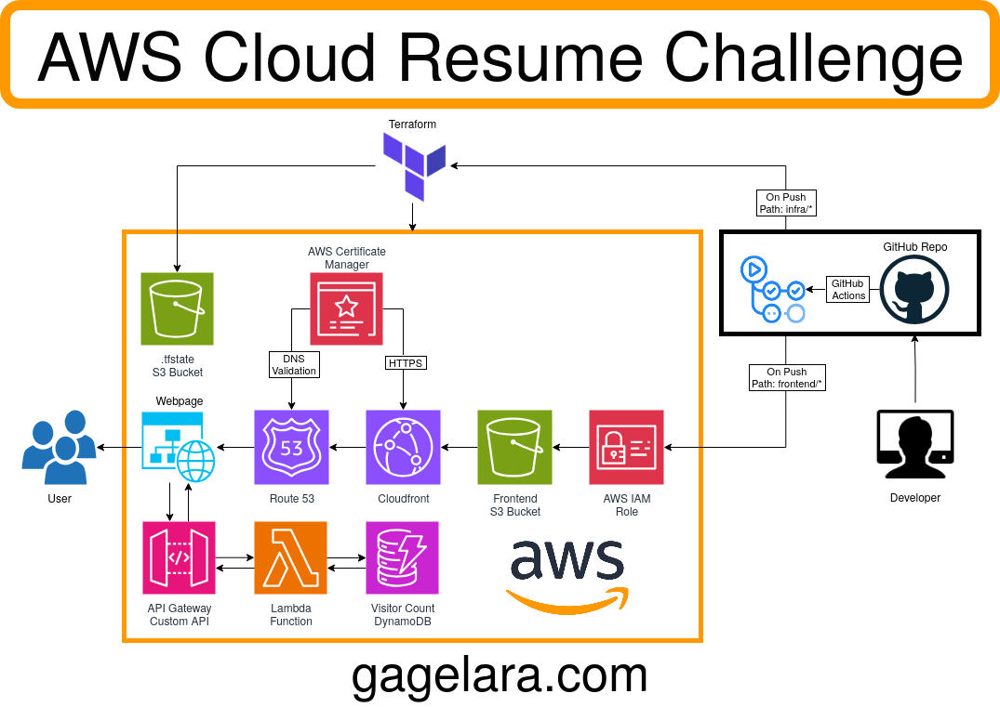

# The Cloud Resume Challenge

For the last few months I've been pouring a lot of my free time into studying and portfolio projects as I work towards beginning a career in cloud engineering & DevOps. Today marks a major milestone, as I've completed the [Cloud Resume Challenge](https://cloudresumechallenge.dev/). You can view my resume at [gagelara.com](https://gagelara.com) and check out [the GitHub Repository here](https://github.com/metamageia/resume.gagelara). In this blog post I'll be talking a little bit about my experience with this project. 

Prior to doing the challenge I hadn't had much hands on experience with full projects working with either AWS or Terraform. I had been experimenting with both on-and-off while watching tutorials, but this was my first time putting the things I had learned to work in a project I would share. 

Before breaking down the project itself it's best I address the one omission from the challenge here, and that is the AWS Cloud Practitioner certification. This was not an oversight or deliberate evasion, but a matter of necessity. I've been putting in the necessary work to prepare for the exam for a while now, but due to financial constraints I can't currently afford to sit the exam, so It's my plan to pursue  certification as soon as I have the means to. 

In preparation for the project there were a few things I knew I'd want to have in place going in. First and most obvious is a domain, which I chose to use my primary domain gagelara.com for the time being rather than putting it behind a subdomain. Second I wanted to set up a nix-flake for the project with some of the packages and dependencies I knew I'd need going into the project (*I use NixOS btw*). 

The first place I started was setting up the backend, as I knew I wanted to do the [Terraform version](cloudresumechallenge.dev/docs/extensions/terraform-getting-started/) of the AWS Cloud Resume Challenge so I'd get some practical hands-on experience using it to provision infrastructure. I wanted to challenge myself to start with Terraform and avoid configuring anything in the AWS console (spare a few minor exceptions), and this turned out to be a lot of fun. Because I've used NixOS as my daily driver for over a year now I've come feel at home with declarative configuration in general, and I found that spending more time with Terraform actually reduced the amount of friction I experienced in provisioning AWS resources. Terraform is a tool I'm excited to continue using and experimenting with - I've already begun rebuilding my cloud homelab from scratch using it to set up resources on Digital Ocean, but that's a blog post for another time. 

Setting up the static website itself was a familiar process I had gone through a couple times before while learning the basics of AWS: 
- Creating a S3 Bucket with some placeholder HTML
- Deploy a CloudFront Distribution then set up OAC & and IAM S3 Policy to access the private bucket
- Modified my existing Route 53 Hosted Zone managing my other subdomains to include the resume rather than configuring a new one, because I wanted to continue using gagelara.com for this project. 
- Set up SSL/TLS Certificate with ACM to enable HTTPS

After manually applying the Terraform configuration for the above resources a couple times, I got to work on setting up the CI/CD pipeline for the project. I've used GitHub Actions in a lot of personal projects prior to this one, and I've previously [written a beginners tutorial](https://blog.gagelara.com/post/effortless-obsidian-to-quartz-cicd-for-beginners-with-github-actions/) on using them to deploy static websites on GitHub Pages, but this was my first time using them to automate processes between separate platforms. It took a bit of tinkering before I properly configured Open ID Connect Identity Provider and properly permission the IAM Role to allow GitHub Actions to manage resources on AWS, but once that was done I quickly finished the work of automating the provisioning & modification of AWS resources. 

With the core infrastructure in place I was ready to start building the website proper. I initially began writing a bit of HTML and CSS, but after stumbling across the aesthetically appealing [sada theme](github.com/darshanbaral/sada) for Hugo, I decided I'd use that as a starting point instead. After examining the theme's code for a bit, I began modifying the layout and adding my resume content. Creating a basic GitOps pipeline for automating the deployment of the frontend was pretty simple at this point, having already worked through the initial friction with the backed deployment. It was at this point I modified both Worfklows to only run when pushing modifications to their relevant directories (frontend/ and infra/) so they weren't both running on every push. 

The final step of the challenge was the most unfamiliar to me, as I'd had zero practical experience setting up or working with APIs and only a couple Python tutorials under my belt. This part took a bit of learning and a few videos to figure out, but it eventually started to click. 

I began by setting up a new API using AWS API Gateway that would connect to a basic Lambda function with a placeholder python script that would return a fixed value. I hit a couple road bumps here as this was my first time encountering Cross-Origin Resource Sharing (CORS). After a bit of googling how to properly set up my API's CORS configuration and writing a bit of Javascript in the frontend to call the API my website was finally displaying its (fake) visitor count. 

Getting the visitor counter working properly required me to learn a bit more Python, and set up a DynamoDB table to store the value. This involved setting up an IAM role and policy to allow Lambda to both get and update items in the DynamoDB table. Once everything was put together, my table was initialized, and my python script updated I had a working counter on my website.

The issue I ran into here though is that my counter wasn't counting the number of visitors, it was counting every visit, which isn't quite what I wanted. I spent a little bit of time thinking about how to implement this simply while respecting user's privacy, as I hadn't written a feature like this before. The solution I settled on:
- Split my API into two separate routes. `/count` endpoint would just return the current visitor count with a `get_count` function, while `/increment` endpoint would increase the visitor count with an `increment` function before calling `get_count`. 
- The frontend JS that calls the API would first check for a simple cookie signaling the user as a returning visitor. If the cookie didn't exist, it would create a `visited=true` cookie with no other identifying information, then call the `/increment` API endpoint. If the cookie already existed (signaling a returning visitor), it would just call the `/count` API endpoint. 

This ended up working pretty well, and provided a  more accurate measure of unique visitors rather than incrementing the counter each time the page was loaded. Pointing two different API routes at different functions in the same script, as opposed to creating unique scripts for each function, also keeps each visit to a single Lambda call rather than two. 

With the visitor counter eliminated the job was pretty much done. I spent some time afterwards cleaning up the repo structure a bit, writing the readme, and making the architecture diagram with [draw.io](https://www.drawio.com/). Ideally the diagram would be made before beginning a project like this during the planning stage - but given that the purpose of this challenge was just as much about hands-on learning, discovering how a project like this is structured was part of the process, and is something I'll be able to map out ahead of time in future projects. 

And that concludes my personal experience with the AWS/Terraform Cloud Resume Challenge. It was an incredible learning experience that solidified my confidence with a lot of the services and tools I got to use in the project, while exposing me to new ones. If you've read the whole thing to the end, I really appreciate you taking the time to do so. If you want to connect feel free to reach out [on LinkedIn](https://linkedin.com/in/gage-lara), or check out what else I'm upto over at [my other links](https://links.gagelara.com/). Stay tuned for my next big project where I'll be building a Kubernetes cloud homelab. 