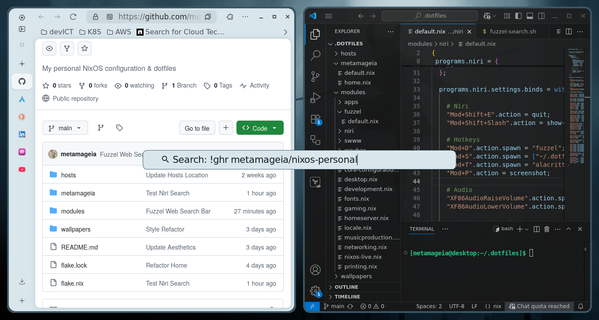

# Everything, Everywhere
## Fuzzel as a Universal Search Bar

This post is less of a tutorial, and more of a short demonstration of a cool tool. This quick little project was inspired by [Theo Browne's video](https://www.youtube.com/watch?v=_DnNzRaBWUU) about his [custom search engine Unduck](https://soydev.link/unduck), which functions primarily as an alternative to [DuckDuckGo Bangs](https://duckduckgo.com/bangs) - a neat feature that allows you to search countless different websites using one of ~13,562 different "Bangs" in your search. 

In his video, Theo demonstrated how setting the browser's default search engine to Unduck allowed him to conveniently use Bangs anywhere - especially with Zen Browser's pop-up search bar. 


I also use Zen as my primary browser, so I played around with this for a while and found it extremely convenient myself. However, I quickly ran into an issue: I kept trying to open the search bar from apps other than my browser. To satisfy this desire to have access to Unduck from anywhere on my computer, I decided to hack together a simple solution that would get me that exact functionality. 

My solution boils down to this script here:

```
#!/usr/bin/env bash

query=$(
  fuzzel -d --prompt-only="Search: "
)

if [ -n "$query" ]; then
  encoded=$(printf '%s' "$query" | jq -sRr @uri)

  xdg-open "https://unduck.link?q=$encoded" >/dev/null 2>&1 &
fi
```

This script launches Fuzzel in dmenu displaying only the prompt bar with the "Search: " prompt. The input is then turned into an unduck query and opened in the default browser. 

I'm using Niri on NixOS as my window manager, so in my `niri.nix` module I add something like this:

```
programs.niri.settings.binds = with config.lib.niri.actions; {
    "Mod+D".action.spawn = "fuzzel";
    "Mod+S".action.spawn = ["~/.dotfiles/modules/niri/fuzzel-search.sh"];
}
```

The resulting behavior allowed me to use Fuzzel in two separate ways: One as an application launcher with `Mod+D` , and the other as a universal web search bar with `Mod+S`. 



The default search engine is Google, and behaves as if using the `!g` Bang. I can search `!ghr metamageia/nixos-personal` to immediately open my public NixOS configuration repository, or add `!t3` to the end of any query to immediately start an AI chat from my search - all of which have been incredibly convenient. 

That's really all I wanted to talk about today, just a short post about a cool tool I've started using. If you found this interesting and wanted to chat feel free to reach out to me on [linkedin](https://www.linkedin.com/in/gage-lara/) or check out any of [my other links](https://links.gagelara.com)